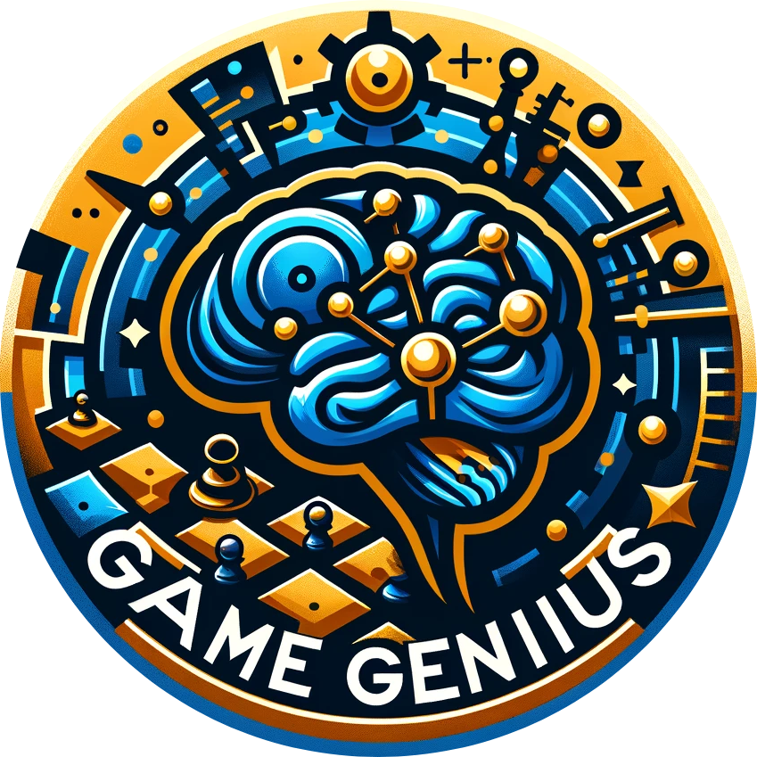
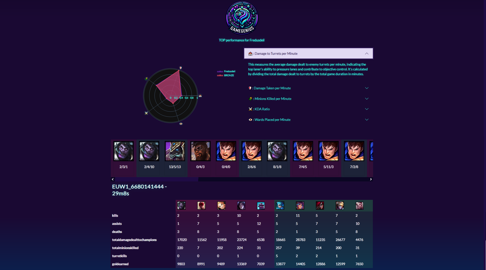

# GameGenius: League of Legends Performance Metrics

## Description

GameGenius is a tool for League of Legends (LoL) players. This application provides insightful metrics, allowing players to compare their in-game performance in a specific role with other players in the same division. It utilizes data visualization to present these metrics in an interactive and user-friendly manner.

## Features
- **Performance Comparison:** Enables LoL players to compare their stats with others in the same division.
- **Role-Specific Metrics:** Focus on performance metrics specific to the player's role.
- **Interactive Data Visualization:** Uses Plotly and Dash for dynamic and interactive graphical representations.
- **User-Friendly Interface:** Command-line and web interfaces for ease of use and accessibility.
- **Database Integration:** Efficiently stores and retrieves player data using a PostgreSQL database.

## Getting Started

### Dependencies
- Python 3.x
- Libraries: requests, psycopg2-binary, dataclasses, python-dotenv, fastapi, inquirerPy, plotly, dash, dash-bootstrap-components, dash-bootstrap-templates, pylint, autopep8
- PostgreSQL Database

### Installing
- Clone the repo : `git clone https://github.com/APBaluchon/projet_informatique_2A.git`
- Install required packages : `pip install -r requirements.txt` 

### Setting Up

- Create a `.env` file in the project root with following variables.
```python
HOST_WEBSERVICE=
HOST=
PORT=
DATABASE=
USER=
PASSWORD=
```
- To set up the database, run the SQL scripts located in the persistance_layer directory. This will create and populate the database with the necessary tables and data. You must  run the creation scripts before the fill scripts.

### Executing the Program

- Run the main application file (e.g., python main.py).
- Access the web application via a browser to view and interact with the performance metrics.

## Output Example

Below is an example of the output generated by GameGenius.



## License
This project is licensed under the [GNU General Public License v3.0](https://www.gnu.org/licenses/gpl-3.0.html).

## Acknowledgments

- The League of Legends community for inspiration.
- Open source projects and libraries that contributed to this project.
